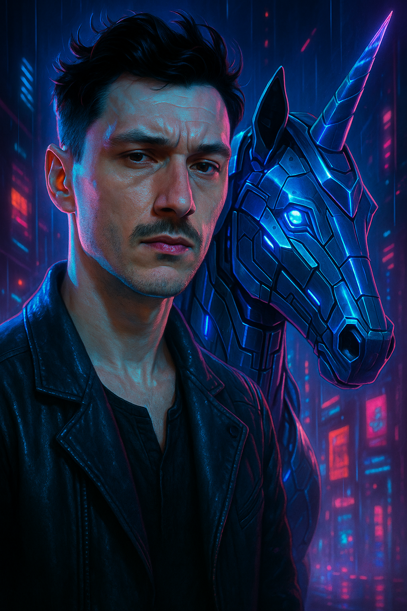

# SPICED-0001
🌶️ Cohort is  
🌪️ Turbinado  
## Frens are  
👾 [Sensei](https://github.com/urbinaj61/urbinaj61)  
🌙 [Anastellar](https://github.com/AnastasiaKhudobasheva)  
👨🏼‍🏫 [The Klausinator](https://github.com/Klausstille)

# Repos
1️⃣ [Week 0001](https://github.com/spiced-academy/turbinado-web-25)  
//  📜 Markdown Live Preview [_](https://markdownlivepreview.com/)  
//  🙂 Skill Icons [_](https://github.com/tandpfun/skill-icons)  
//  💾 Prep System [_](https://github.com/wd-bootcamp/web-setup)  
  

# Achievements and Quests
- [x] There is *always* something to get done
- [x] Git
- [x] Version Control
- [x] Hash
- [x] Commit
- [x] Feel deployed
- [x] Chill in repositories
- [ ] Be bored   

# Images in Markdown
## Using html you can specify the width

## Using Markdown purely is cool to though 
You can even just drag and drop it in

